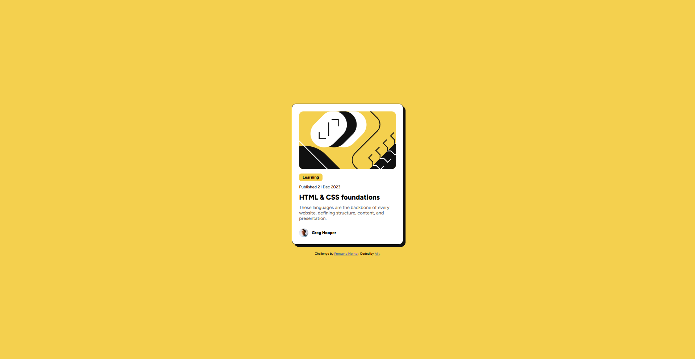

# Frontend Mentor - Blog preview card solution

This is a solution to the [Blog preview card challenge on Frontend Mentor](https://www.frontendmentor.io/challenges/blog-preview-card-ckPaj01IcS). Frontend Mentor challenges help you improve your coding skills by building realistic projects.

## Table of contents

- [Frontend Mentor - Blog preview card solution](#frontend-mentor---blog-preview-card-solution)
  - [Table of contents](#table-of-contents)
  - [Overview](#overview)
    - [The challenge](#the-challenge)
    - [Screenshot](#screenshot)
    - [Links](#links)
  - [My process](#my-process)
    - [Built with](#built-with)
    - [What I learned](#what-i-learned)
    - [Continued development](#continued-development)
    - [Useful resources](#useful-resources)
  - [Author](#author)

## Overview

### The challenge

Users should be able to:

- See hover and focus states for all interactive elements on the page
- View the optimal layout for the component depending on their device's screen size

### Screenshot



### Links

- Solution URL: [GitHub Repository](https://github.com/agusalit/FrontendChallenge-BlogPreview)
- Live Site URL: [Live Demo](https://agusalit.github.io/FrontendChallenge-BlogPreview/)

## My process

### Built with

- Semantic HTML5 markup
- CSS custom properties (CSS variables)
- Flexbox for layout
- Mobile-first workflow
- Custom font loading (@font-face)
- Smooth hover transitions
- Responsive design

### What I learned

This project helped me strengthen my understanding of several key concepts:

**CSS Custom Properties**: I used CSS variables to maintain consistent spacing, colors, and typography throughout the project:

```css
:root {
  --Yellow: #F4D04E;
  --Gray-950: #111111;
  --Gray-500: #6B6B6B;
  --White: #FFFFFF;
  --spacing-300: 24px;
  --spacing-150: 12px;
}
```

**Custom Font Loading**: Implemented proper @font-face declarations for the Figtree font family:

```css
@font-face {
  font-family: "Figtree";
  src: url(assets/fonts/static/Figtree-Medium.ttf);
  font-weight: 500;
}
```

**Interactive Hover Effects**: Created engaging hover states that enhance user experience:

```css
.card:hover {
  box-shadow: 16px 16px 0 var(--Gray-950);
}

.card:hover h1 {
  color: var(--Yellow);
}
```

### Continued development

Areas I want to focus on in future projects:

- **Advanced CSS animations**: Exploring more complex transitions and keyframe animations
- **CSS Grid layouts**: Implementing more sophisticated grid-based designs
- **Accessibility improvements**: Adding better focus management and ARIA attributes
- **Performance optimization**: Optimizing font loading and image delivery

### Useful resources

- [CSS Custom Properties - MDN](https://developer.mozilla.org/en-US/docs/Web/CSS/Using_CSS_custom_properties) - Great reference for CSS variables implementation
- [A Complete Guide to Flexbox](https://css-tricks.com/snippets/css/a-guide-to-flexbox/) - Comprehensive flexbox guide that helped with layout
- [Web.dev Font Loading](https://web.dev/font-display/) - Helpful for understanding font loading strategies

## Author

- Frontend Mentor - [@agusalit](https://www.frontendmentor.io/profile/agusalit)
- GitHub - [@agusalit](https://github.com/agusalit)